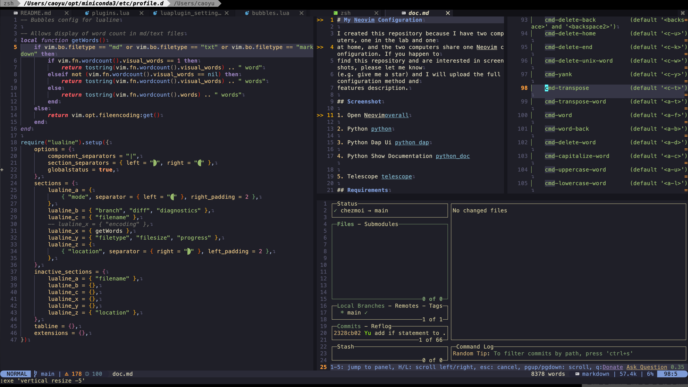
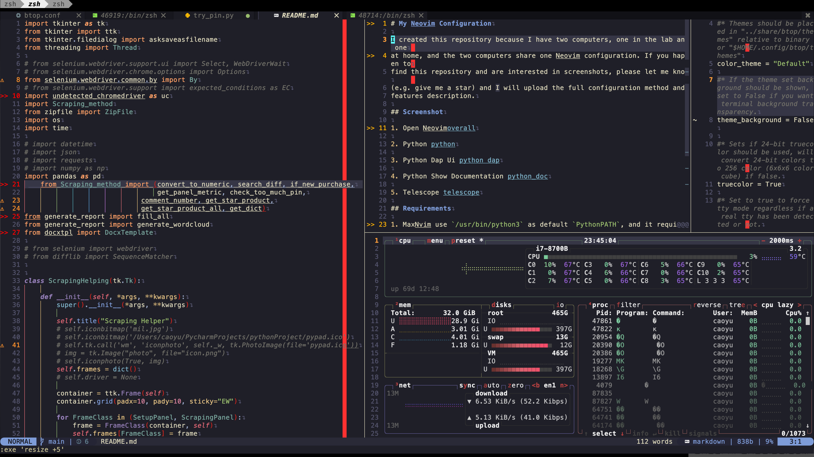

# dotfiles

The development of NeoVim really amazed me, it is super powerful, and fancy.
Plugins made it a full power modern IDE. However, NeoVim lives in Termnial, it's
hard to display Image, I don't think someday there is a Jupyter Plugin like the
one in vscode developed for nvim. So eventually, I have to use vscode for some
works.

## Screenshots

1. Transparent 

2. Lazygit 

3. Btop 
