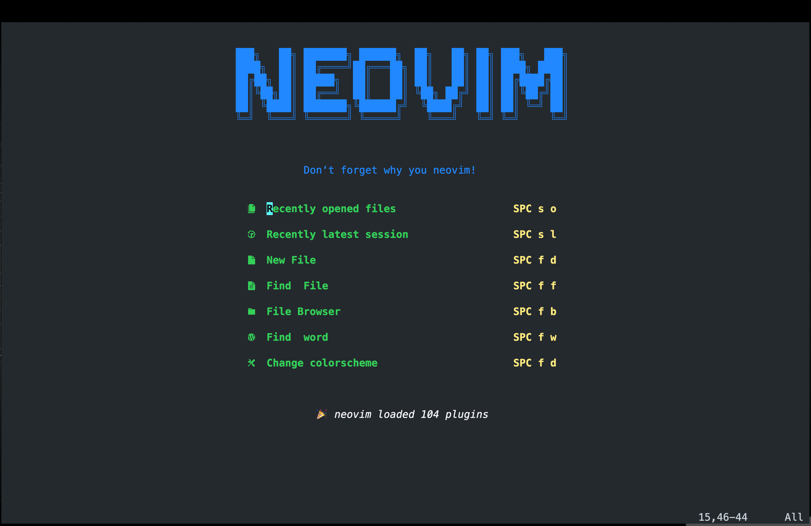
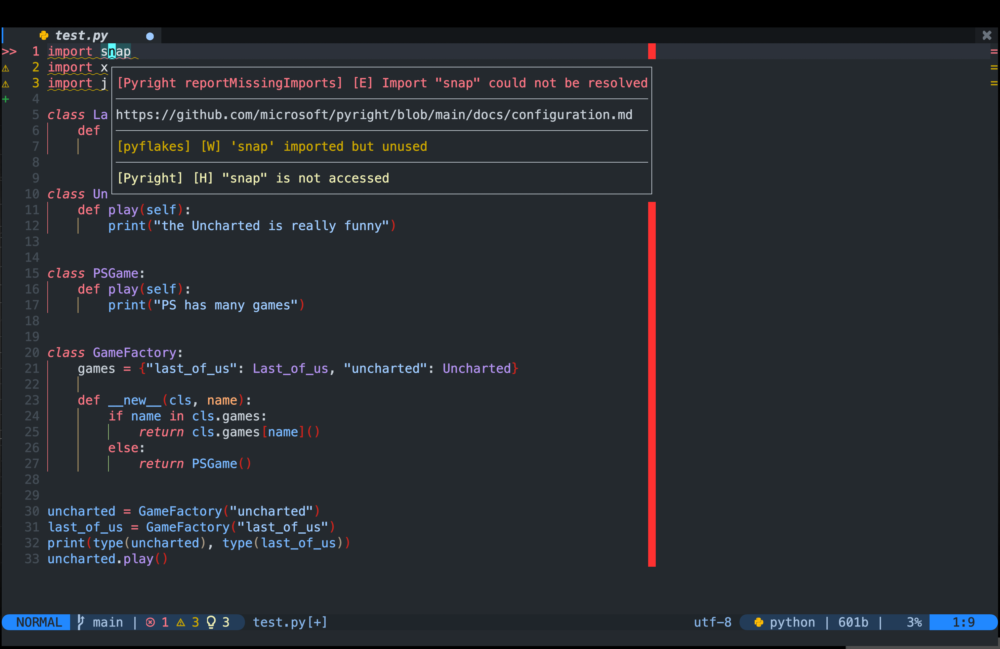
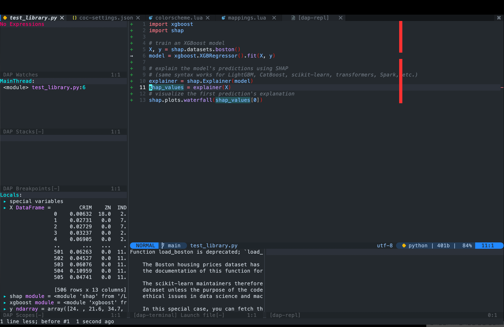
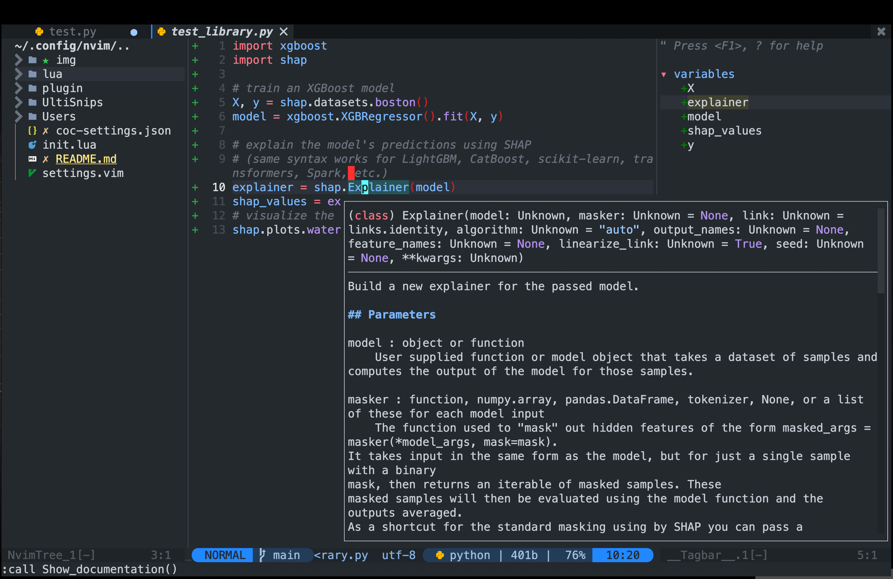
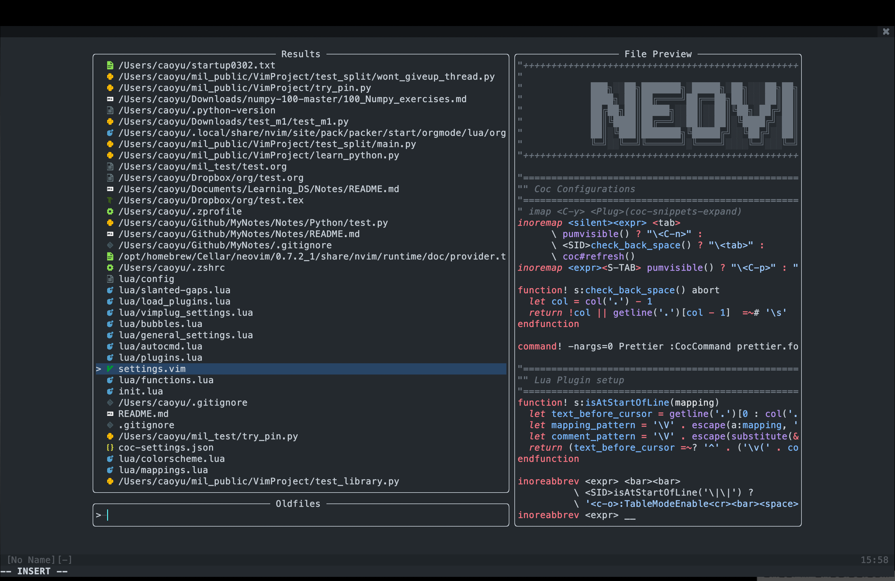

# My Neovim Configuration

I created this repository because I have two computers, one in the lab and one
at home, and the two computers share one Neovim configuration. If you happen to
find this repository and are interested in screenshots, please let me know (e.g.
give me a star) and I will upload the full configuration method and features
description.

## Screenshot

1. Open Neovim

2. Python 

3. Python Dap Ui 

4. Python Show Documentation 

5. Telescope 

## Structure

```
├── after
│   └── ftplugin
│       ├── c.lua
│       ├── cpp.lua
│       ├── go.lua
│       ├── jsonc.lua
│       ├── json.lua
│       ├── make.lua
│       ├── proto.lua
│       └── rust.lua
├── coc-settings.json
├── img
│   ├── coc_documentation.png
│   ├── ctags_nvimtree.png
│   ├── dap_ui.png
│   ├── overall.png
│   ├── python.png
│   └── telescope.png
├── init.lua
├── lua
│   ├── configs
│   │   ├── autopairs.lua
│   │   ├── bufferline.lua
│   │   ├── coc.lua
│   │   ├── dashboard.lua
│   │   ├── evil_lualine.lua
│   │   ├── gitsign.lua
│   │   ├── indent-line.lua
│   │   ├── lsp
│   │   │   ├── cmp.lua
│   │   │   ├── handlers.lua
│   │   │   ├── init.lua
│   │   │   ├── lsp_saga.lua
│   │   │   └── settings
│   │   │       ├── jedi.lua
│   │   │       ├── pylsp.lua
│   │   │       ├── pyright.lua
│   │   │       ├── sumneko_lua.lua
│   │   │       └── tsserver.lua
│   │   ├── lualine.lua
│   │   ├── neotree.lua
│   │   ├── nvimtree.lua
│   │   ├── org-bullets.lua
│   │   ├── sidebar.lua
│   │   ├── symbols_outline.lua
│   │   ├── transparent.lua
│   │   └── treesitter.lua
│   └── core
│       ├── autocmd.lua
│       ├── colorscheme.lua
│       ├── functions.lua
│       ├── general_settings.lua
│       ├── highlight.lua
│       ├── mappings.lua
│       ├── plugins.lua
│       └── vimplugin_setting.lua
├── plugin
│   └── packer_compiled.lua
├── README.md
└── snippets
    ├── lua.json
    ├── package.json
    └── python.json

10 directories, 53 files
```

## Requirements

1. MaxNvim use `/usr/bin/python3` as default `PythonPATH`, and it requires
   following python modules:
    1. neovim
    2. black
    3. python-language-server
    4. debugpy
2. Packer
3. Node.js

## Usage
